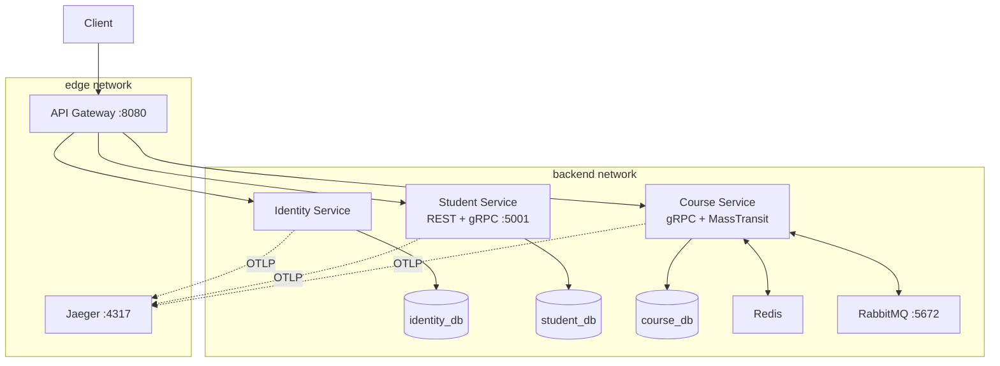
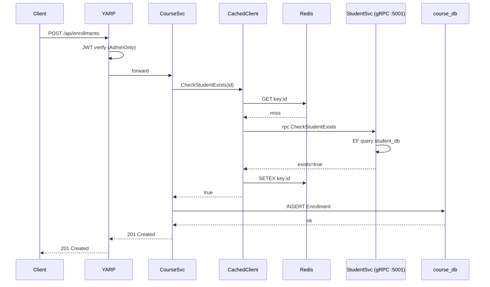

# Lab 3: gRPC and Microservices Architecture

**Course:** PRN232
**Stack:** ASP.NET Core 9.0, PostgreSQL 17, gRPC, YARP, Serilog, Swashbuckle, OpenTelemetry, Jaeger, Redis, MassTransit on RabbitMQ, Microsoft.Extensions.Http.Resilience (Polly), Docker Compose.

## 1. Service Decomposition

Four deployable units under `PRN232_Lab03/src/`. Each owns its data, has its own Dockerfile, and runs as a separate container.



- **Identity Service** (`src/Services/PRN232.LMS.IdentityService/`). Handles auth: `POST /api/auth/login`, `POST /api/auth/refresh-token`, `GET /api/admin` (AdminOnly). Persists users and refresh tokens in `identity_db`.
- **Student Service** (`src/Services/PRN232.LMS.StudentService/`). Owns canonical student records. REST CRUD at `/api/students` and `/api/v2/students` (`Asp.Versioning.Mvc`) plus a gRPC server on Kestrel HTTP/2, port 5001.
- **Course Service** (`src/Services/PRN232.LMS.CourseService/`). Owns the academic catalog (Courses, Enrollments, Semesters, Subjects). The only synchronous consumer of the Student gRPC contract; also publishes and consumes `StudentCreatedIntegrationEvent` via MassTransit.
- **API Gateway** (`src/Gateway/PRN232.LMS.ApiGateway/`). YARP-based: terminates JWTs, enforces route policies, aggregates Swagger, exposes port 8080. No business logic.

## 2. Database Design

One PostgreSQL database per service, each in its own container (`identity-db`, `student-db`, `course-db`) on `backend`. No cross-database access. EF Core migrations under `Migrations/`.

| Service | Database | Key entities | Seeder |
| --- | --- | --- | --- |
| Identity | `identity_db` | `AppUser`, `RefreshToken` | admin + demo user |
| Student | `student_db` | `Student` | demo students for the API tests |
| Course | `course_db` | `Course`, `Enrollment`, `Semester`, `Subject`, `ReceivedStudentEvents` | demo semesters/subjects/courses |

Cross-service references are by id only (`Enrollment.StudentId`). `ReceivedStudentEvents` is the read-side projection written by the MassTransit consumer.

## 3. API Gateway Configuration

YARP at `src/Gateway/PRN232.LMS.ApiGateway/Program.cs`. Routes and clusters declared in `appsettings.json` (`ReverseProxy:Routes`, `ReverseProxy:Clusters`). JWT wired through shared `AddLmsJwtAuth` (Bearer scheme against `Jwt:Secret` / `Jwt:Issuer` / `Jwt:Audience`).

| Route | Cluster | Policy |
| --- | --- | --- |
| `/api/auth/{**}` | identity | Anonymous |
| `/api/admin/{**}` | identity | AdminOnly |
| `/api/students/{**}`, `/api/v{ver}/students/{**}` | student | ReadOrAdmin |
| `/api/courses/{**}`, `/api/enrollments/{**}`, `/api/semesters/{**}`, `/api/subjects/{**}` | course | ReadOrAdmin |
| `/api/semesters/{semesterId}/courses` | course | AdminOnly |
| `/swagger/{svc}/v{n}/swagger.json` | per-service | Anonymous (path-rewritten) |

Policies defined in `src/PRN232.LMS.Shared/Auth/`: `Anonymous`, `ReadOrAdmin` (role `Read` or `Admin`), `AdminOnly` (role `Admin`). YARP evaluates the per-route `AuthorizationPolicy` before forwarding (401 from the gateway, never reaching the backend). Active health checks every 30s on `/health`. The gateway is the only container on `edge`; everything else is on `backend` only.

Swagger aggregation: `AddLmsSwagger` plus explicit `SwaggerEndpoint` calls for Identity, Student v1/v2, and Course; the gateway proxies the documents.

## 4. gRPC Communication Flow

Contract at `src/PRN232.LMS.Protos/Protos/student.proto` (proto3, `csharp_namespace = "PRN232.LMS.Protos"`), compiled with `GrpcServices="Both"`.

```proto
service StudentGrpc {
  rpc GetStudentById (GetStudentByIdRequest) returns (StudentGrpcResponse);
  rpc CheckStudentExists (CheckStudentExistsRequest) returns (StudentExistsResponse);
}
```

Server (`StudentService/Grpc/StudentGrpcService.cs`) maps both RPCs to EF Core queries and is registered with `app.MapGrpcService<StudentGrpcService>()` on Kestrel HTTP/2, port 5001. Client (`CourseService/Program.cs`) registered as `AddGrpcClient<StudentGrpc.StudentGrpcClient>` with `AddStandardResilienceHandler()` (Polly retry + circuit breaker + per-attempt timeout).

`CachedStudentGrpcClient` (`CourseService/Grpc/`) wraps the typed client, checks Redis keyed by student id, and falls through to gRPC on a miss. Controllers depend on `IStudentGrpcClient`, so the cache is invisible to callers.

### Enrollment Sequence



`EnrollmentService.CreateEnrollmentAsync` (`CourseService/Services/EnrollmentService.cs:116`) calls `IStudentGrpcClient.CheckStudentExistsAsync`, throws `EnrollmentValidationException` (mapped to 400) on false, and persists otherwise.

## 5. Authentication and Authorization

HS256, shared `Jwt:Secret` (min 32 chars), `Issuer = PRN232.LMS`, `Audience = PRN232.LMS.Client`. Access tokens 1h; refresh tokens 7d, stored in `RefreshToken` rows in `identity_db`. Rotation-on-use: every successful refresh revokes the presented token and stores the replacement id in `ReplacedByToken` for replay detection.

Roles are `role` claims. `AddLmsJwtAuth` defines `ReadOrAdmin` and `AdminOnly`; `EnrollmentsController`, `StudentsController`, `StudentsV2Controller`, and `AdminController` apply them per action (e.g. `ReadOrAdmin` on GET, `AdminOnly` on POST/PUT/DELETE). The gateway re-validates the same token before forwarding, so the route policy is the primary gate.

## 6. Docker Deployment

`docker-compose.yml` at the repo root:

- **App services**: `api-gateway` (8080, `edge` + `backend`), `identity-service`, `student-service` (gRPC 5001), `course-service`. All on `backend` only except the gateway.
- **Datastores** (`backend`): `identity-db`, `student-db`, `course-db` (Postgres 17, one per service), `redis` (6379), `rabbitmq` (5672 internal, 15672 UI on `edge`).
- **Observability**: `jaeger` (16686 UI, 4317 OTLP, on `edge`), `dozzle` (9999, on `edge`).

Every app has healthcheck `curl -f http://localhost:8080/health || exit 1` with 30s start period. The gateway waits on the three services with `service_healthy`. `edge` for user-facing surfaces, `backend` for internals; the gateway is the only container on both.

## 7. Bonus Features Implemented

- **Redis caching of gRPC responses.** `CachedStudentGrpcClient` short-circuits `GetStudentById` and `CheckStudentExists` against Redis.
- **OpenTelemetry + Jaeger.** Every service registers `AddOpenTelemetry().WithTracing(...)` with ASP.NET Core and `HttpClient` instrumentation, OTLP-exported to `jaeger:4317`. Traces correlate gateway ingress, YARP forward, downstream REST, and the gRPC hop.
- **Polly resilience on the gRPC client.** `AddStandardResilienceHandler()` provides retry with exponential backoff, circuit breaker, and per-attempt timeout. Combined with the cache decorator, transient failures fall through to a warm cache before the breaker opens.
- **MassTransit over RabbitMQ.** `CourseService` consumes `StudentCreatedIntegrationEvent` and projects each event into `ReceivedStudentEvents` in `course_db`, giving Course a read-side view of student lifecycle without polling Student.
